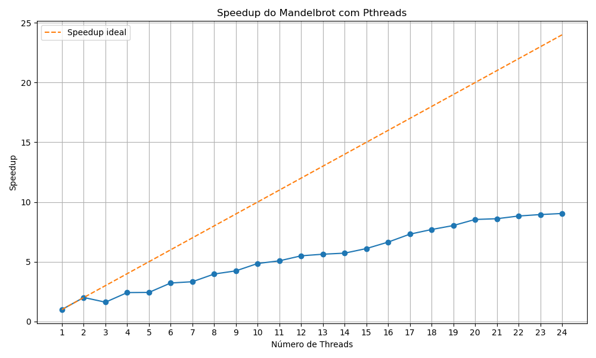
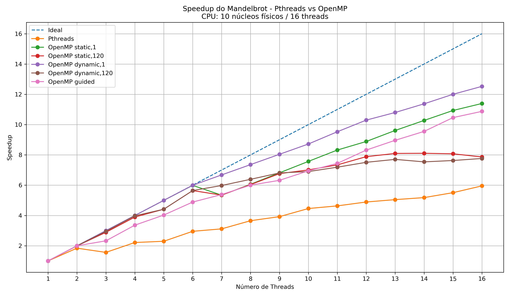

# Mandelbrot Paralelo — Pthreads vs OpenMP

Trabalho de Programação Paralela — **José** e **André Fidelis** (UDESC).

Gera o conjunto de Mandelbrot em uma matriz de caracteres e mede o **speedup**
obtido ao paralelizar o cálculo de duas formas:

1. **Pthreads** — divisão estática das linhas em faixas contíguas, uma por thread.
2. **OpenMP** — cinco políticas de escalonamento (`static,1`, `static,120`,
   `dynamic,1`, `dynamic,120`, `guided`).

O ponto do trabalho é comparar as políticas de escalonamento. Por isso as duas
versões compartilham o mesmo núcleo de cálculo (`mandelbrot.hpp`) e a mesma
estrutura de memória — a única diferença entre elas é **como as linhas são
distribuídas entre as threads**.

---

## Estrutura

| Arquivo | O que é |
|---|---|
| `mandelbrot.hpp` | Núcleo compartilhado: cálculo do fractal, leitura da entrada, impressão |
| `mandelbrot.cpp` | Versão com **pthreads** → binário `mandelbrot` |
| `mandelbrotOmp.cpp` | Versão com **OpenMP** → binário `saida` |
| `benchmark.py` | Módulo comum aos dois scripts: executa, cronometra, salva CSV, plota |
| `grafico.py` | Benchmark da versão pthreads (1 a 24 threads) |
| `grafico_omp.py` | Benchmark da versão OpenMP + comparação com pthreads |
| `Makefile` | Compilação das duas versões |
| `resultados_*.csv` | Tempos médios e speedups medidos |
| `*.png` | Gráficos gerados |

---

## Requisitos

- `g++` com suporte a C++11, pthreads e OpenMP
- Python 3.8+ e matplotlib:

```bash
pip3 install -r requirements.txt
```

> **macOS:** o `g++` padrão é o Apple clang, que **não aceita `-fopenmp`**.
> Para compilar a versão OpenMP, instale o GCC de verdade
> (`brew install gcc` e use `make CXX=g++-14`) ou o runtime
> (`brew install libomp`). A versão pthreads compila normalmente.

---

## Compilação

```bash
make              # compila as duas versões
make mandelbrot   # apenas pthreads
make saida        # apenas OpenMP
make clean        # remove os binários
```

Equivalente manual:

```bash
g++ -O2 -Wall -Wextra -pthread mandelbrot.cpp -o mandelbrot
g++ -O2 -Wall -Wextra -fopenmp mandelbrotOmp.cpp -o saida
```

---

## Execução manual

Os parâmetros vêm da **entrada padrão**, um por linha.

**Pthreads** — `linhas`, `colunas`, `max_iter`, `n_threads`:

```bash
printf '30\n78\n300\n4\n' | ./mandelbrot --print
```

**OpenMP** — `linhas`, `colunas`, `max_iter` (as threads e o escalonamento vêm
do ambiente):

```bash
printf '30\n78\n300\n' | \
  OMP_NUM_THREADS=4 OMP_SCHEDULE=dynamic,120 ./saida --print
```

Sem `--print` nada vai para o `stdout` — é assim que os benchmarks rodam, para
não medir o custo de imprimir 1,8 MB de texto. O tempo do cálculo é sempre
escrito no `stderr`:

```
tempo_calculo: 12.345678
```

---

## Benchmarks

```bash
make
python3 grafico.py         # pthreads → resultados_mandelbrot.csv + grafico_aceleracao.png
python3 grafico_omp.py     # OpenMP   → resultados_OpenMP_*.csv + speedup_mandelbrot_comparacao.png
```

Use `--no-show` para salvar o gráfico sem abrir a janela (útil em SSH).

`grafico_omp.py` **depende** de `resultados_mandelbrot.csv`, então rode
`grafico.py` primeiro.

### Configuração

As constantes ficam no topo de cada script:

| Constante | `grafico.py` | `grafico_omp.py` |
|---|---|---|
| `MAX_ROW` × `MAX_COLUMN` | 2300 × 790 | 2300 × 790 |
| `MAX_N` (teto de iterações) | 4800 | 4800 |
| Threads | 1 a 24 | 1 a 16 |
| `REPETITIONS` | 10 | 10 |
| `CHUNK` | — | 120 |

`grafico.py` faz 24 × 10 = **240 execuções**. `grafico_omp.py` faz
5 configurações × 16 × 10 + 10 de referência = **810 execuções**. Os dois
levam horas.

### Como o speedup é calculado

- **Pthreads:** referência = a própria execução com 1 thread.
- **OpenMP:** referência = `static,1` com 1 thread, a **mesma** para as cinco
  configurações — sem isso as curvas não seriam comparáveis entre si.

---

## Resultados

### Pthreads



### Pthreads vs OpenMP



> ⚠️ Os gráficos e CSVs versionados aqui foram gerados pela **versão anterior**
> do código, antes das correções listadas abaixo. Rode os benchmarks de novo
> para obter números consistentes com o código atual.

### Ambiente de teste

- Intel Core i7-13620H — 10 núcleos físicos / 16 threads
- 16 GB de RAM

O benchmark de pthreads vai até 24 threads de propósito, para mostrar o que
acontece **depois** de saturar as 16 threads de hardware.

---

## Notas de implementação

Decisões que afetam diretamente os números medidos:

- **Bloco contíguo de memória.** As duas versões alocam a matriz como um único
  bloco de `linhas × colunas` bytes. A versão OpenMP antiga fazia um `malloc`
  por linha, o que dava a ela um padrão de acesso à memória diferente e tornava
  a comparação com pthreads injusta.
- **`norm(z) < 4` no lugar de `abs(z) < 2`.** São equivalentes, mas `norm` não
  calcula raiz quadrada — e essa conta estava dentro do laço mais quente.
- **`z * z` no lugar de `pow(z, 2)`.** `pow` promovia a conta para `double` e
  voltava para `float` a cada iteração; além de mais lento, isso impedia a
  compilação no clang.
- **Cronometragem interna.** O tempo é medido dentro do programa e cobre apenas
  o cálculo. Antes ele era medido pelo Python por fora, incluindo o custo de
  subir o processo e de alocar a matriz.
